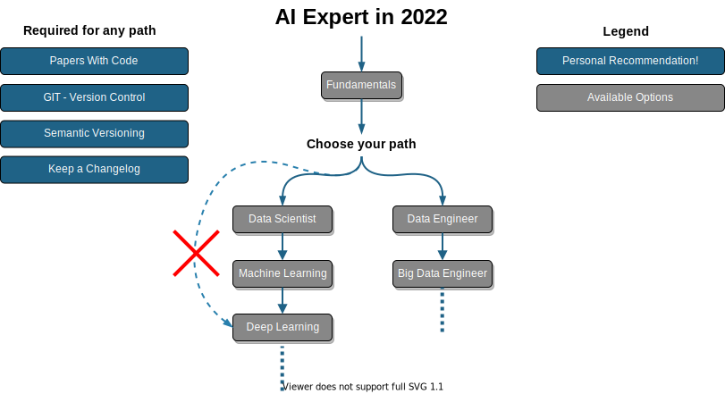
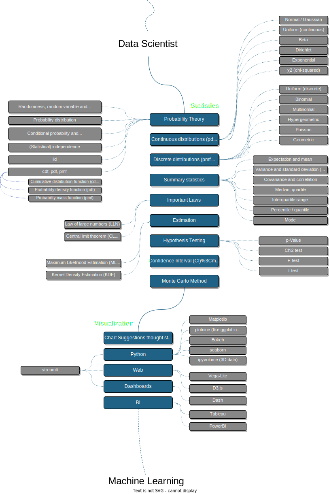
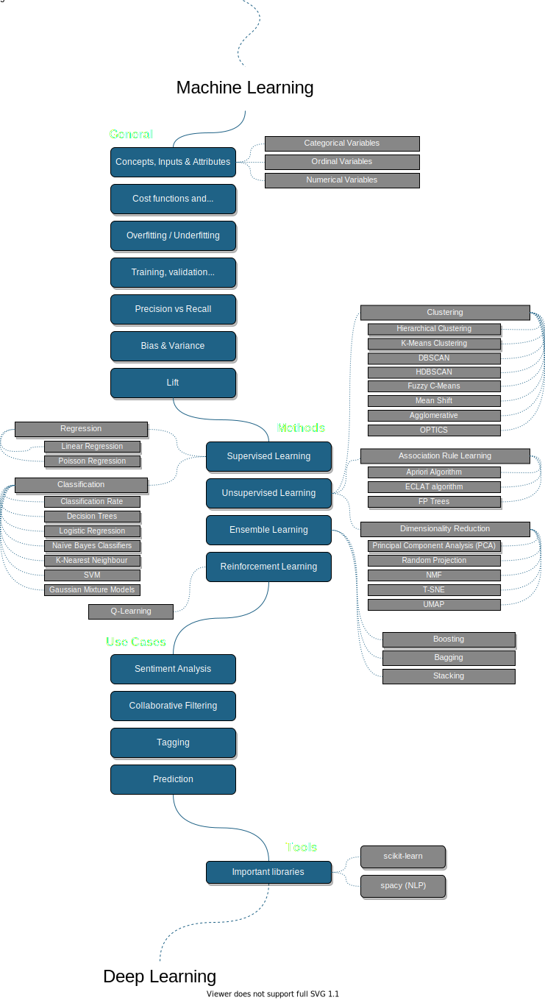
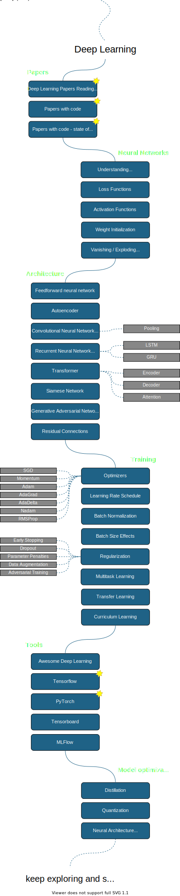
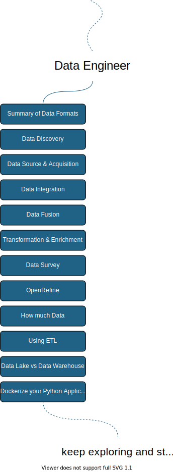
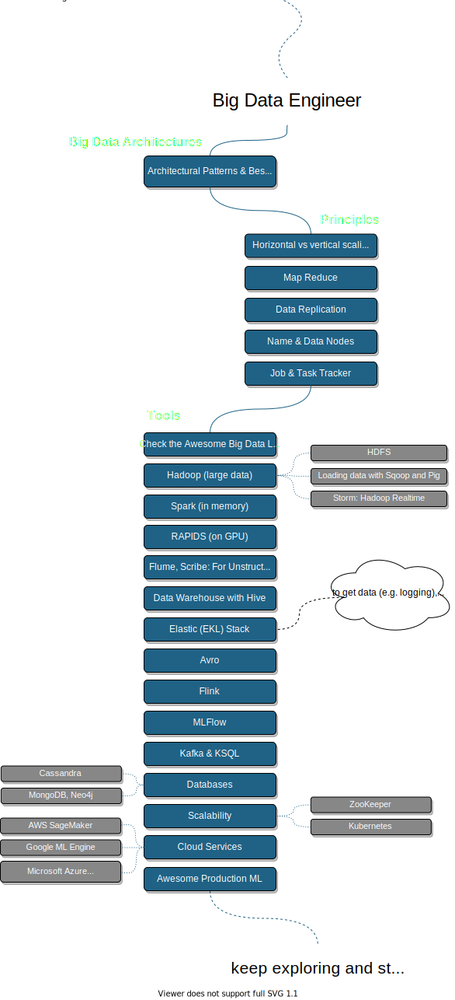
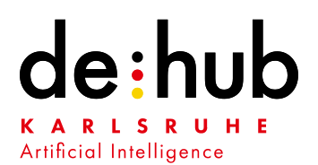

  
  <h2 align="center">i.am.ai AI Expert Roadmap</h2>
  
Roadmap to becoming an Artificial Intelligence Expert in 2020

  

      
      
      
      

  

   

Below you find a set of charts demonstrating the paths that you can take and the technologies that you would want to adopt in order to become a data scientist, machine learning or an ai expert. We made these charts for our new employees to make them AI Experts but we wanted to share them here to help the community.

If you are interested to become an AI EXPERT at [AMAI](https://am.ai) in Germany, or you want to hire an AI Expert, please say [hi@am.ai](mailto:hi@am.ai).

## Note

👉 An **interactive version with links to follow** about each bullet of the list can be found at [i.am.ai/roadmap](https://i.am.ai/roadmap) 👈

To receive updates [star :star:](https://github.com/AMAI-GmbH/AI-Expert-Roadmap/stargazers) and watch :eyes: the [GitHub Repo](https://github.com/AMAI-GmbH/AI-Expert-Roadmap/) to get notified, when we add new content to stay on the top of the most recent research.

## Disclaimer

The purpose of these roadmaps is to give you an idea about the landscape and to guide you if you are confused about what to learn next and not to encourage you to pick what is hip and trendy. You should grow some understanding of why one tool would better suited for some cases than the other and remember hip and trendy never means best suited for the job.

## Introduction

  

## Data Science Roadmap

  

## Machine Learning Roadmap

  

## Deep Learning Roadmap

  

## Data Engineer Roadmap

  

## Big Data Engineer Roadmap

  

## 🚦 Wrap Up

If you think any of the roadmaps can be improved, please do open a PR with any updates and submit any issues. Also, we will continue to improve this, so you might want to watch/star this repository to revisit.

## 🙌 Contribution

> Have a look at the [contribution docs](./contributing.md) for how to update any of the roadmaps

* Open pull request with improvements
* Discuss ideas in issues
* Spread the word
* Reach out with any feedback

## Supported By

